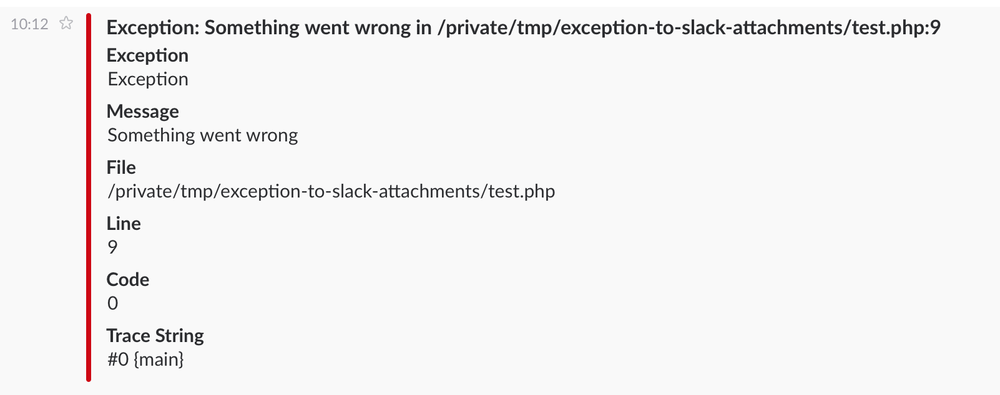

# exception-to-slack-attachments
Format PHP Exception to Slack Attachments array for alek13/slack.

[](https://circleci.com/gh/ariarijp/exception-to-slack-attachments)

## Requirements
PHP 5.6+ is required.

## Installation
Add these lines to your `composer.json`.

```json
"require": {
    "ariarijp/exception-to-slack-attachments": "0.1.0"
}
```

## Usage example

```php
<?php

require_once __DIR__ . '/vendor/autoload.php';

use ExceptionToSlackAttachments\ExceptionToSlackAttachments;
use Maknz\Slack;

try {
    throw new \Exception('Something went wrong');
} catch (\Exception $e) {
    $attachments = ExceptionToSlackAttachments::toAttachments($e);

    $client = new Slack\Client('http://your.slack.endpoint');
    $client->to('#general')
        ->attach($attachments)
        ->send();
}
```

Run above code, then you will receive message like below.




## License
MIT

## Author
[ariarijp](https://github.com/ariarijp)
